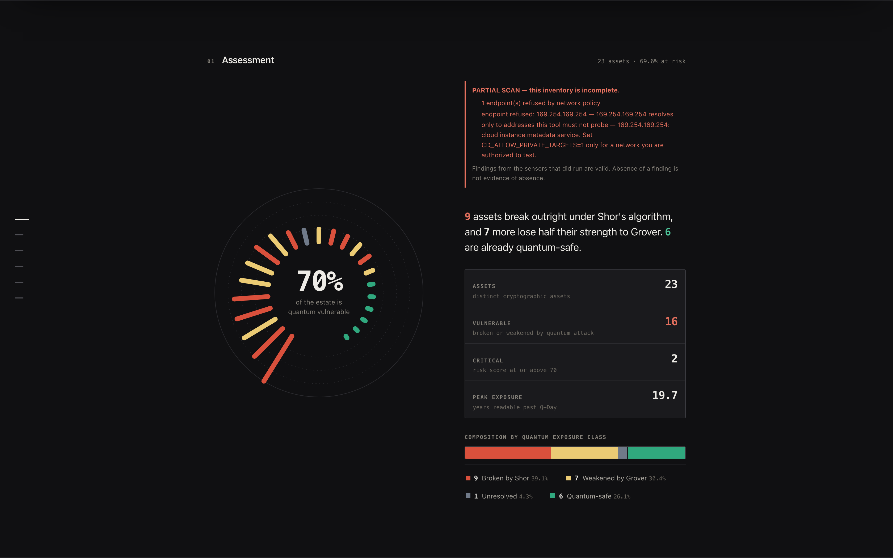
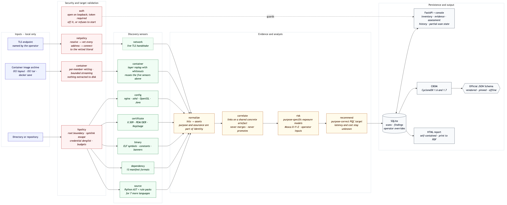
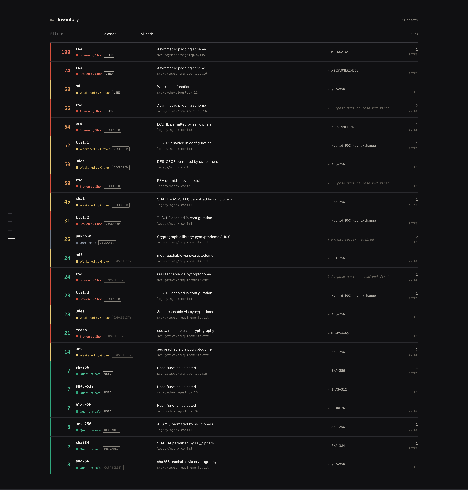
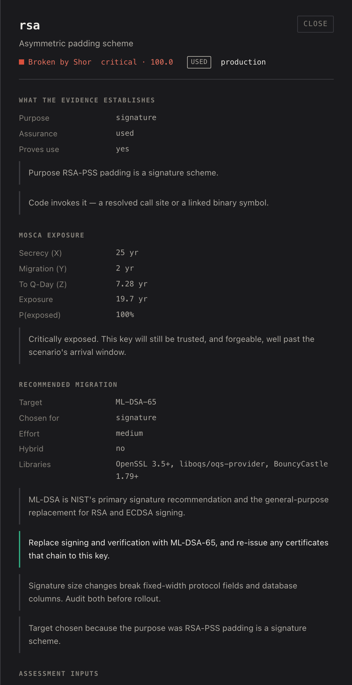
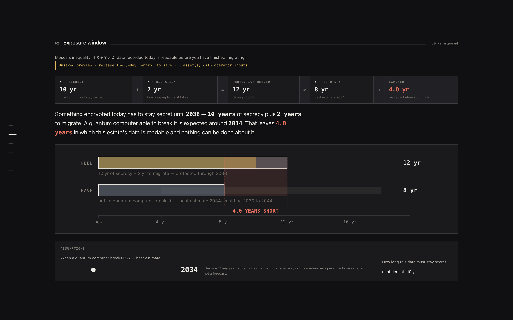
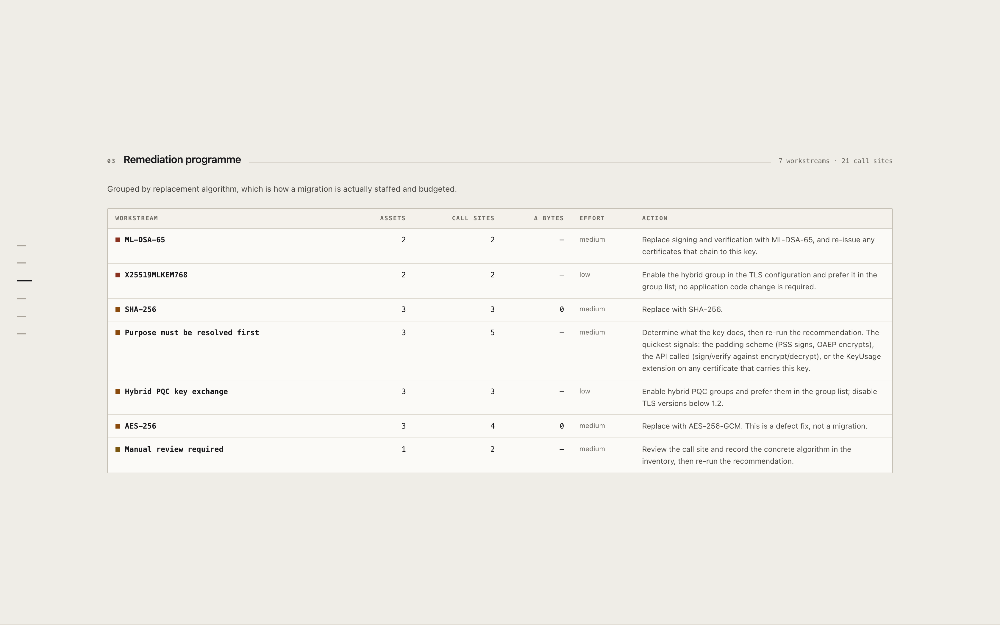
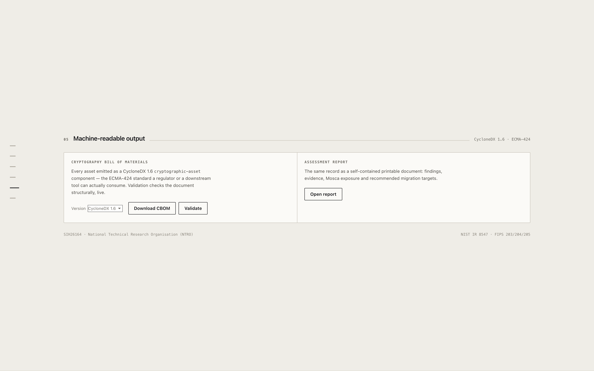
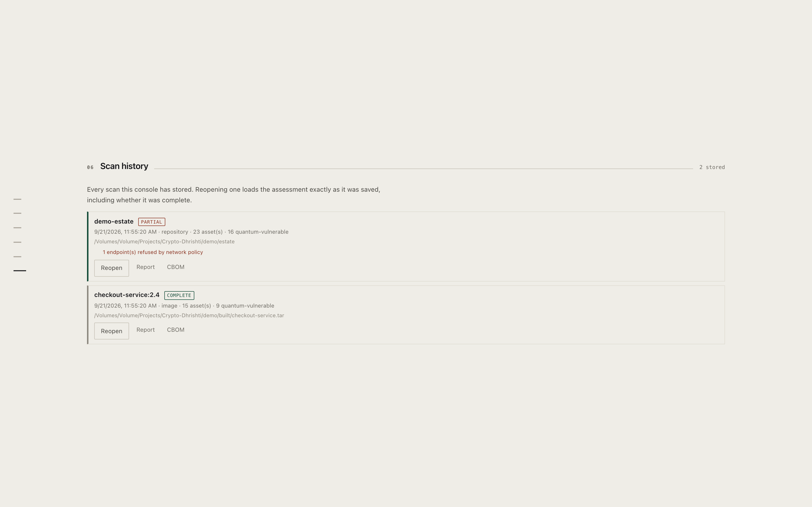

# CryptoDrishti

**Find every cryptographic asset an organisation owns, prove what the evidence
actually supports, and say what each one must become.**

Seven sensors read source code, dependency manifests, ELF binaries, X.509
certificates, deployment configuration, container image archives and live TLS
endpoints. Every finding becomes a distinct asset, classified by what a quantum
computer does to it, scored through Mosca's inequality, matched to a named
post-quantum replacement, and exported as a
[CycloneDX](https://cyclonedx.org/) CBOM — 1.6 (ECMA-424) or 1.7 — validated
offline against the official JSON Schema.

Three things it does that a keyword scanner cannot:

- **Purpose, not keyword.** RSA signing and RSA key transport are one algorithm
  and two different migrations, ML-DSA against ML-KEM. Purpose is resolved from
  the call site, and where the evidence is silent the tool names *no* target
  rather than the wrong one.
- **Assurance is a field.** `capability` · `declared` · `used` · `observed`.
  A library that *can* do RSA is not evidence that RSA runs.
- **Containers read layer by layer.** A key deleted by a later layer is
  reported as **historical** — gone at runtime, still extractable from the
  archive.

Built for Smart India Hackathon 2026 — problem statement **SIH26164**,
*Enterprise Cryptographic Discovery & Analysis Tool (ECDAT)*, National
Technical Research Organisation. Team **146876 — Zero-Day**.

[](https://github.com/sgtsujith141-wq/cryptodrishti/actions/workflows/ci.yml)
[](https://www.python.org/)
[](https://cyclonedx.org/)
[](#testing)



<sub>Every screenshot in this README is a capture of the running tool against the database `python run.py --demo` produces. Nothing is mocked.</sub>

---

## The problem

The replacement cryptography is finished and almost nothing has moved. NIST
published ML-KEM, ML-DSA and SLH-DSA in 2024 as FIPS 203, 204 and 205, and
NIST IR 8547 sets out the transition to them. The mathematics is not the
blocker: an organisation cannot migrate what it cannot enumerate. In practice nobody knows where their cryptography actually
is: it is scattered across application source, transitive dependencies,
compiled binaries with no source available, certificate stores, deployment
configuration and live TLS endpoints.

The pressure is not theoretical. Under **harvest-now-decrypt-later**, an
adversary records encrypted traffic today and decrypts it once a
cryptographically relevant quantum computer exists. Data with a long
confidentiality requirement is therefore already exposed — the clock started
when the traffic was recorded, not when the quantum computer arrives.

That reframes the question from *"is my crypto broken yet?"* to *"will the data
I am sealing today still be secret when it stops being secret?"* — which is a
question about **shelf life, migration time and an unknown arrival date**, not
about algorithms alone.

## What I built

A single-operator tool that answers that question end to end:

1. **Seven independent sensors** read what is actually present, rather than
   trusting a manifest or a policy document — including local container image
   archives, read without a daemon and without extracting anything.
2. Raw detector hits are **normalised into distinct cryptographic assets**, so
   one algorithm seen 800 times is one migration item with 800 call sites — not
   800 findings.
3. Each asset is **scored through Mosca's inequality**, with Q-Day modelled as
   a probability distribution rather than asserted as a date.
4. A **recommender** selects a concrete NIST replacement for the deployment
   profile, and quantifies the size penalty that will break fixed-width
   protocol fields.
5. Everything is exported as a **CycloneDX 1.6 or 1.7 CBOM**, validated
   offline against the official JSON Schema, and rendered in an offline web
   console.

It runs **fully air-gapped**. There are no outbound network requests, no CDN
assets and no telemetry. The single exception is the network sensor, which
connects only to endpoints you name **and** that pass the destination policy
described under [Security](#security).

## Architecture



<sub>Rendered from [`architecture.mmd`](docs/architecture/architecture.mmd) by [`render.py`](docs/architecture/render.py), which also produces the dark variant used in the submission deck. One source, two palettes, so the two cannot disagree about what the system does.</sub>

Editable source: [`docs/architecture/architecture.mmd`](docs/architecture/architecture.mmd).
Rendering instructions and a note on what the diagram deliberately omits are in
[`docs/architecture/README.md`](docs/architecture/README.md).

Read it left to right in five bands:

1. **Inputs** — a directory or repository, a container image archive, or a TLS
   endpoint the operator names. All three are local; nothing is fetched.
2. **Security and target validation** — every input passes a gate before any
   sensor sees it. The filesystem boundary refuses symlink escapes and vets
   archive members; the destination policy resolves, vets every resolved
   address, then connects to the vetted literal.
3. **Seven discovery sensors** — source, dependency, binary, certificate,
   config, container and network. The network sensor is drawn dashed because it
   is the only one that leaves the machine.
4. **Evidence and analysis** — hits are normalised into distinct assets
   (purpose and assurance are part of an asset's identity, not annotations on
   it), correlated across sensors, scored, and matched to a target.
5. **Persistence and output** — SQLite, the console, the CBOM, and a
   self-contained HTML report.

**There is no box for a cloud provider, a KMS, an HSM or a container
registry.** None of those integrations exist, so none is drawn.

**The registry is the load-bearing piece.** Every finding resolves to an entry
in `app/knowledge/algorithms.py` (74 algorithms), and that entry decides how it
is classified, scored and remediated. Getting a classification wrong there is
wrong everywhere downstream, which is why it is the most heavily tested module
in the project.

## Verified features

Everything below is exercised by the test suite or reproducible with the
commands given in [Testing](#testing).

### Seven sensors

| Sensor | Technique | Strength of evidence |
|---|---|---|
| `source` | Python AST analysis; curated rule packs for C/C++, C#, Go, Java, JavaScript, PHP, Python and Ruby; four language-agnostic rules (inline private key, inline certificate, hardcoded secret, ECB mode) apply to every recognised file | AST resolves parameters (`key_size=1024`); rule packs do not. Rust and Swift files are recognised and scanned, but only by the four language-agnostic rules |
| `dependency` | Package manifests mapped to library crypto capability and PQC support | Capability, not proof of use |
| `binary` | ELF symbol tables, cryptographic constant matching, version banners | Symbols are strong; raw strings are weak |
| `certificate` | X.509, PEM/DER, private key material, including PQC certificates | Parsed, not guessed |
| `config` | nginx, Apache, sshd, OpenSSL, Java security policy | As actually deployed |
| `network` | Live TLS probing, including hybrid PQC group negotiation | Ground truth for what is negotiated |
| `container` | Local OCI and `docker save` archives, streamed without extraction; layers replayed with whiteouts | Reuses the five analysers above, so evidence strength is theirs — plus image and layer provenance |

### Classification

74 algorithms, split the standard three ways — and the split is the point:

- **Shor-broken** (22) — RSA, DSA, DH, ECDH, ECDSA, Ed25519, X25519. A total
  break. **Increasing the key size does not help**, which is why RSA-4096 and
  RSA-1024 are both classified broken.
- **Grover-weakened** (23) — AES-128, 3DES, SHA-1, MD5, RC4. Effective security
  halves, so the fix is a **parameter change, not an algorithm change**.
- **Quantum-safe** (27) — ML-KEM, ML-DSA, SLH-DSA, FN-DSA, AES-256, SHA-384/512.
- **Hybrid** (1) — X25519 + ML-KEM-768 — and **unresolved** (1), which is never
  treated as safe.

The distinction that drives the whole recommender: `AES-128` is weakened but
`AES-256` is safe, so symmetric findings get a key-length fix; RSA at any size
is broken, so it gets a new algorithm.

### Risk scoring

Mosca's inequality — **X + Y > Z**, where X is data confidentiality lifetime, Y
is migration time, and Z is years to a CRQC. Exposure is `X + Y − Z`.

Z is genuinely unknown, so it is **not asserted**. It is modelled as a
triangular distribution over (earliest, likely, latest) and reported as a
probability alongside the exposure at the median. The console lets you drag
those three years and re-rank the entire estate live.

Every score is a transparent product of named factors — base class weight,
algorithm adjustment, business criticality, exposure multiplier, Mosca term,
blast radius, confidence — and **each factor is surfaced in the UI next to its
input value**. Nothing is fitted or learned; a reviewer can audit the
arithmetic.

Findings are weighted by where the evidence lives, so a private key in a test
fixture is inventoried but does not outrank one in production code.

### Standards output

CycloneDX 1.6 (ECMA-424) with `cryptoProperties`, detection evidence in
`evidence.occurrences` and per-finding confidence in `evidence.identity`.
`cbom.validate()` checks required fields, enum membership and `bom-ref`
uniqueness — and **says plainly that it is a structural check, not full
JSON-Schema validation**.

## Screenshots

Captures of the running application, in its dark theme, taken from the database
that `python run.py --demo` produces. Reproduce them with
[`submission/build/capture_screens.py`](submission/build/capture_screens.py).
No interface here is a mock-up.

**The point of the whole tool, in one screen** — the same `rsa` algorithm
resolved to three different purposes, with three different recommendations, and
the third refusing to name a target at all:



**Every finding opens onto its evidence** — file, line, technique, confidence,
assurance grade, and the exposure arithmetic behind the score, with each input
labelled by where its value came from:



<details>
<summary>More views — exposure window, migration programme, CBOM export, scan history</summary>

**Exposure window** — Mosca's inequality as arithmetic the operator can argue
with, not a verdict:



**Remediation programme** — grouped by replacement algorithm, because that is
how a migration is actually staffed:



**Machine-readable output** — CBOM export and live schema validation on the
same screen:



**Scan history** — a partial scan is labelled `PARTIAL` with its reason, never
presented as a complete inventory:



</details>

## Installation

Requires **Python 3.11+**. No other system dependencies.

```bash
git clone https://github.com/sgtsujith141-wq/cryptodrishti.git
cd cryptodrishti

python3 -m venv .venv
./.venv/bin/pip install -r requirements.txt
./.venv/bin/python run.py
```

Open <http://127.0.0.1:8000> and point the console at any directory.

### Demo quickstart — one command

```bash
./.venv/bin/python run.py --preflight-offline   # check the demo's dependencies
./.venv/bin/python run.py --demo                # build, scan, assess
./.venv/bin/python run.py                       # console on 127.0.0.1:8000
```

`--demo` needs no network and no credentials. It:

1. builds a container image archive and a pair of certificates from the
   committed fixtures in [`demo/`](demo/);
2. scans the synthetic service estate — and is deliberately pointed at one
   endpoint the destination policy refuses, so the scan finishes **PARTIAL**
   with its reason recorded;
3. scans the container image archive, replaying layers so a key deleted by a
   later layer is reported as **historical**;
4. saves an operator override on the RSA signing asset (25-year shelf life,
   restricted, hardware-backed) and rescores against it.

What you should see: **23 assets, 16 quantum-vulnerable, PARTIAL** for
`demo-estate`, and **15 assets, 9 quantum-vulnerable, COMPLETE** for
`checkout-service:2.4`. The fixtures and what each one demonstrates are listed
in [`demo/README.md`](demo/README.md).

Every key in the demo fixtures is synthetic and marked as such; the preflight
check fails if any file carrying a `PRIVATE KEY` marker is not.

`--preflight` is the same check including the network-dependent paths, and
`--demo-reset` rebuilds the exact demo state if you have scanned over it.

### Command line

```bash
# Scan source, print the ranked inventory, write a CBOM
./.venv/bin/python -m app.cli scan /path/to/repo --cbom cbom.json --cbom-version 1.7
```

> **The CLI runs the source sensor only.** It does not read dependency
> manifests, configuration, certificates, binaries or container images, so its
> CBOM is a subset of what the console produces for the same directory. Scanning
> `demo/estate` gives 7 assets from the CLI and 23 from the console, and the
> difference is entirely sensors the CLI does not invoke. Use the console, or
> `run.py --demo`, for a full inventory.

### Scanning something real

The committed demo in [`demo/`](demo/) is synthetic by design: it is small
enough to read, and every finding in it is one we can point at a line for. To
see the tool against real code, clone anything and scan it:

```bash
git clone --depth 1 https://github.com/paramiko/paramiko /tmp/paramiko
./.venv/bin/python -m app.cli scan /tmp/paramiko
```

Third-party repositories are **not committed** to this repository.

### Reproducing the accuracy figures

```bash
./.venv/bin/python -m benchmark.run                                   # measure
./.venv/bin/python -m benchmark.run --baseline benchmark/results/baseline-382e7d1.json
```

Two results, measured on two different corpora. They are reported separately
because comparing them to each other would be meaningless.

**A — like-for-like.** The same corpus (manifest 1.0.0), before and after the
fixes the benchmark prompted. This is the number that says whether the work
improved the detectors:

| | TP | FP | FN | Precision | Recall | F1 |
|---|---|---|---|---|---|---|
| Before (`baseline-382e7d1.json`) | 79 | 5 | 5 | 0.941 | 0.941 | **0.941** |
| After (`after-m6-same-corpus.json`) | 84 | 3 | 0 | 0.966 | 1.000 | **0.983** |

Recall reached 1.000 and three false positives remain. Those three were later
found to be *correct detections the original labelling had missed* — an OpenSSL
suite name that states its own digest, and a Go import that the language
guarantees is used. They were relabelled in corpus 1.1.0, with the reason and
the effect on the score written into `benchmark/manifest.json`'s changelog, so
the change is auditable rather than invisible. **Labels were never changed in
the other direction**: every finding the tool produced that the corpus does not
justify still counts against it, and two such defects were fixed in the
detectors instead.

**B — current corpus.** Manifest 1.2.0, expanded to cover the binary,
certificate and container sensors, which the original corpus did not exercise
at all:

| | TP | FP | FN | Precision | Recall | F1 |
|---|---|---|---|---|---|---|
| `after-m6.json` | 116 | 0 | 0 | 1.000 | 1.000 | **1.000** |

Purpose is correct on 114 of 114 scored cases (2 excluded as genuinely
ambiguous); assurance on 116 of 116.

#### What these numbers are not

- **They are not real-world accuracy.** This is a synthetic corpus written by
  the same person who wrote the detectors. It measures this corpus and nothing
  else. Accuracy on real enterprise code is **unmeasured** and is not claimed
  anywhere in this project.
- **A score of 1.000 is a statement about the corpus, not the tool.** It means
  the corpus has stopped finding defects — which is a reason to write harder
  cases, not to stop.
- **Network accuracy is excluded entirely.** What a TLS handshake negotiates
  depends on the local OpenSSL build, so it cannot carry a stable expected
  result. The network sensor is exercised by the harness and reported
  separately, never folded into precision or recall.
- **Known gaps in the corpus**, each of which would lower the score if added:
  obfuscated or dynamically dispatched call sites, vendored third-party trees,
  Mach-O and PE binaries, and SHA-1-signed certificates.

The ground truth was written by reading the fixtures, never by running
CryptoDrishti — `benchmark/manifest.json` records that, and the matching rules,
in the file itself.

## Configuration

There are no secrets and no `.env` file. Behaviour is tuned with optional
environment variables, all of which have working defaults:

| Variable | Default | Purpose |
|---|---|---|
| `CD_DB` | `data/scans.sqlite3` | Scan-history database location |
| `CD_MAX_FILES` | `25000` | Upper bound on files per scan, so a large repository finishes inside a demo |
| `CD_WORKERS` | `8` | Scanner thread-pool size |

Risk-model defaults — Q-Day estimates and shelf life by data sensitivity — live
in `app/config.py` and are overridable per scan from the console.

## Testing

```bash
./.venv/bin/pip install -r requirements-dev.txt
./.venv/bin/pytest
```

**664 tests, all passing**, covering:

| Suite | Tests | What it pins |
|---|---|---|
| `test_recommend.py` | 111 | Every algorithm yields an actionable target; no vulnerable algorithm is ever recommended as a replacement; purpose and profile change the answer |
| `test_security.py` | 91 | Destination policy, filesystem boundary, access control, redaction — including that a fixture secret never reaches an export |
| `test_assessment.py` | 70 | Per-asset risk inputs, their provenance, overrides surviving a rescan |
| `test_detection_correctness.py` | 61 | The purpose, hash-identity and TLS corrections, each pinned against the defect it fixed |
| `test_standards_and_reporting.py` | 61 | CycloneDX 1.6 and 1.7 against the official schemas; the full report reaches every finding |
| `test_container_scan.py` | 43 | Layer replay, whiteouts, effective vs historical assets |
| `test_knowledge.py` | 38 | Classification of all 74 algorithms; RSA key size is irrelevant; AES-128 vs AES-256; unresolved is never treated as safe |
| `test_container_security.py` | 32 | Archive member vetting, size budgets, nothing extracted to disk |
| `test_risk.py` | 30 | Mosca arithmetic, mode vs median, determinism, exposure models per purpose |
| `test_normalize.py` | 29 | Hit merging; scanner, purpose and assurance stay part of asset identity |
| `test_benchmark_regressions.py` | 29 | One test per defect the benchmark found |
| `test_scan_end_to_end.py` | 21 | Real fixture files in, scored findings and a valid CBOM out |
| `test_cbom.py` | 17 | CBOM structure — **and that the validator rejects malformed documents** |
| `test_benchmark_harness.py` | 16 | The harness itself: dedupe, one-to-one matching, no double counting |
| `test_api.py` | 15 | Every HTTP route the console calls, against a temporary database |

The suite writes to a temporary database, never to `data/`.

### Reproducing a real scan

```bash
git clone --depth 1 https://github.com/paramiko/paramiko demo/targets/paramiko
./.venv/bin/python -m app.cli scan demo/targets/paramiko
```

At paramiko commit `142f593` this reports **12 distinct cryptographic assets
across 70 files in 1.3s — 8 of them quantum-vulnerable (66.7%)**, correctly
separating production findings (ECDSA P-256/384/521 as critical, RSA as high,
AES as medium) from test-only ones (a private key in `tests/test_pkey.py`, weak
RNG in `tests/test_sftp_big.py`). Your numbers will differ as paramiko changes.

### Continuous integration

[`.github/workflows/ci.yml`](.github/workflows/ci.yml) runs the suite on Python
3.11, 3.12 and 3.13, then runs a separate smoke job that scans this repository,
emits a CBOM and **fails the build if the document does not conform** to
CycloneDX 1.6. The CBOM is uploaded as a build artifact.

## Engineering decisions and trade-offs

**Q-Day is a distribution, not a date.** Every commercial tool in this space
picks a year and scores against it. That is the single easiest thing for a
cryptographer to dismiss, because the honest answer is that nobody knows. I
model Z as a triangular distribution and report `P(exposed)` alongside the
median. *Trade-off:* a probability is harder to put on a dashboard tile than
"2030", and it makes the tool look less certain than its competitors.

**The score is arithmetic, not a model.** A transparent product of named
factors instead of anything fitted. *Trade-off:* it will be less accurate than
a model trained on real migration outcomes — but no such labelled dataset
exists, and a reviewer who can audit the arithmetic will trust the output. An
unauditable number in a security tool is worse than a slightly worse auditable
one.

**Findings are weighted by where the evidence lives.** An algorithm in
`tests/` gets 0.40× and vendored code 0.75×. Without this, scanning any real
repository puts test fixtures at the top of the queue and the report reads as
naive. *Trade-off:* path heuristics misfire on unconventional layouts.

**Unresolved is a first-class class, ranked above quantum-safe.** When the
scanner cannot statically resolve an algorithm it says so rather than guessing,
and the recommender returns "manual review required" instead of a plausible
replacement. Filing "we could not identify this" as good news is how scanners
lose trust.

**Six independent sensors rather than one good one.** They deliberately
overlap, and `normalize.py` does not merge findings across sensors — source and
binary evidence for the same algorithm corroborate each other, and collapsing
them would destroy that signal. *Trade-off:* the inventory is larger than a
naive deduplication would produce.

**Zero front-end dependencies.** The console is vanilla JavaScript with no
build step, no framework and no CDN. The tool is aimed at an air-gapped
environment, where a tool that needs npm at install time is a tool that does not
get installed. *Trade-off:* `app/web/app.js` is 1,200 hand-written lines, and
some of it would be shorter in React.

**CycloneDX rather than a bespoke format.** There is exactly one standard for
cryptographic inventory, so the output is consumable by anything that reads
CycloneDX. *Trade-off:* the schema does not have a natural place for a
Mosca-style risk model, so those fields live in a vendor extension.

**Structural validation, honestly labelled.** Bundling the CycloneDX JSON
schema would mean a network fetch or a vendored schema file and a validation
dependency, both of which conflict with running air-gapped. So `validate()`
does a thorough structural check and its output states exactly what it did and
did not verify.

## Container images

Point it at a local image archive and it reads what is actually shipped —
which is where the gap between what a team wrote and what they run is widest.
A base image nobody chose carries an OpenSSL nobody audited.

```bash
# In the console: choose "Container image archive", then Browse.
# Or over the API:
curl -X POST localhost:8000/api/scan -H 'Content-Type: application/json' \
  -d '{"path": "/path/to/image.tar", "target_kind": "image", "image": "app:1.0"}'
```

**Supported**, and nothing beyond it:

| Format | Notes |
|---|---|
| OCI image layout (directory) | `oci-layout` + `index.json` + `blobs/` |
| OCI image layout (tar) | Same, packed |
| `docker save` archive | `manifest.json` + layer tars |

Compression: gzip, bzip2, xz. **zstd layers are named and refused**, not
silently reported as empty. No daemon, no network, no privileged access, and
**nothing is ever extracted to disk** — members are streamed into memory and
analysed there.

**Not supported**, stated because a security tool that overstates coverage is
worse than one with less of it: pulling from a registry, Windows images,
signature or attestation verification, and anything the underlying analysers
cannot do (Mach-O symbol tables, for instance, are still string-matched).

Detection is not reimplemented. Each file goes to the analyser that already
handles it, so an ELF inside an image is read by the code that reads an ELF on
disk, at the same confidence, recording the technique that actually ran.

**Layers are replayed in order**, with `.wh.` and `.wh..wh..opq` whiteouts
applied. A file deleted by a later layer is still extractable from the
archive, so it is still inventoried — but as **historical**, not as live
content. The commonest reason a key is in a layer at all is that somebody
noticed and deleted it in the next one.

An archive holding more than one image is **refused until one is named**. Each
image is a different estate, and picking one silently would inventory
something the operator did not ask about.

### Archive safety

Every member is vetted before a byte is read: upward traversal, absolute paths,
drive letters, control characters, links whose targets escape the archive
root, device nodes, FIFOs and sockets are all refused **and counted**, because
a silent skip means reporting an incomplete image as complete. Member count,
per-file size, total uncompressed bytes, nesting depth and wall clock are
bounded — the total-bytes bound is what stops a decompression bomb, and it
works because we were never writing to disk.

## Correlation

Two detectors seeing the same thing is worth recording. It is not worth
merging, and it is definitely not worth promoting.

`engine/correlate.py` links findings that share a **concrete artefact** — the
same file, the same file in the same layer, or the same component a detector
actually identified (an OpenSSL version banner, a named dependency). A shared
*algorithm name* links nothing: an estate uses AES in forty unrelated places.

What correlation may never do:

- **Turn capability into observed.** A dependency that can do RSA, corroborated
  by a call site that does, is still a dependency that can do RSA. The link is
  recorded on both; neither one's assurance moves.
- **Raise confidence.** Two detectors agreeing often means two readings of the
  same bytes, and there is no calibration that would justify a number.
- **Bridge two purposes.** Findings are bucketed by `(algorithm, purpose)`
  before anything is linked, so RSA signing can never join RSA key transport.
- **Hide disagreement.** Conflicting key sizes, modes or assurance states are
  recorded and shown.

A path maps to a component only when every library-naming finding there
agrees. A `requirements.txt` listing six packages is a list, not a component.

## Measured accuracy

Until M6 this project had never measured its own detection accuracy, and said
so. It now has a hand-labelled corpus and a reproducible harness.

```bash
python benchmark/run.py                        # measure
python benchmark/run.py --baseline results/baseline-382e7d1.json
```

Over `benchmark/corpus` (manifest 1.2.0, 116 labelled findings, six scanners):

| Scanner | TP | FP | FN | Precision | Recall | F1 |
|---|---|---|---|---|---|---|
| source | 58 | 0 | 0 | 1.000 | 1.000 | 1.000 |
| dependency | 15 | 0 | 0 | 1.000 | 1.000 | 1.000 |
| config | 14 | 0 | 0 | 1.000 | 1.000 | 1.000 |
| container | 14 | 0 | 0 | 1.000 | 1.000 | 1.000 |
| certificate | 10 | 0 | 0 | 1.000 | 1.000 | 1.000 |
| binary | 5 | 0 | 0 | 1.000 | 1.000 | 1.000 |
| **Overall** | **116** | **0** | **0** | **1.000** | **1.000** | **1.000** |

**Read that with the caveat it deserves.** A perfect score means the corpus has
stopped finding defects, not that the tool is perfect. The same person wrote
the fixtures and the detectors and knows what they look for. These numbers
measure this corpus and nothing else; they are **not** an estimate of accuracy
on real-world code, which this project still has not measured.

The number worth looking at is the like-for-like one — the same corpus, before
and after the fixes the benchmark prompted:

| | Precision | Recall | F1 |
|---|---|---|---|
| Before | 0.941 | 0.941 | 0.941 |
| After | 0.966 | 1.000 | 0.983 |

### What measuring found that reading did not

Seven detector defects, none visible by inspection:

- A hyphen inside a cipher name was treated as an OpenSSL exclusion marker, so
  `ECDHE-RSA-AES256` silently dropped RSA and AES-256 — four false negatives,
  every one in the direction that makes an estate look cleaner than it is.
- `TLSv1` matched inside `TLSv1.2` (`\b` treats the dot as a boundary), so TLS
  1.0 was reported as enabled on a server offering only 1.2 and 1.3.
- `DES` matched inside `DES-CBC3`, which is Triple DES.
- `HmacSHA256` did not resolve — a MAC whose name states what it is.
- The ECB rule asserted `aes` for every match, inventing an AES finding from
  `RSA/ECB/OAEPPadding` in a file with no AES in it.
- Certificate signature digests were inventoried only when broken, so a healthy
  estate's CBOM listed no certificate hash functions at all.
- Binary symbols that state their operation (`RSA_sign`) left the purpose
  unresolved: the M2 purpose work had never reached the sensor whose whole job
  is vendor binaries with no source.

Each has a regression test. The corpus also caught a double-count in the
benchmark harness itself.

## Standards conformance

Two checks exist, and conflating them would be the overclaim this whole tool
is shaped to avoid:

| Check | What it is |
|---|---|
| **Structural** | Required fields, enum membership, bom-ref uniqueness, reference integrity. Fast, dependency-free. **Not conformance.** |
| **Official** | Validation against the JSON Schema the CycloneDX project publishes, vendored at a pinned commit and checksummed on load. |

Both are reported separately by the API, the CLI and the console. A run where
official validation could not happen reports `checked: false` — never a pass.
A check that silently did not run is worse than one that failed.

The schemas live in `app/schemas/cyclonedx/`, copied from upstream at a commit
recorded in `PROVENANCE.md`. Validation is **offline**: no network call, so two
runs over the same estate cannot disagree because upstream changed. A schema
edited locally fails its checksum and is refused, because a validator you can
quietly modify is not a validator.

```bash
python -m app.cli scan ./src --cbom out.json --cbom-version 1.7
```

**Versions genuinely supported: 1.6 (the default) and 1.7.** 1.7 is a real
implementation, not a relabelled 1.6 — it uses `ellipticCurve` (a namespaced
closed enum: `nist/P-256`) for the deprecated `curve`,
`relatedCryptographicAssets` for the deprecated `signatureAlgorithmRef`, and
`algorithmFamily`, which splits RSA into `RSASSA-PSS` and `RSAES-OAEP` and is
therefore **omitted** when the purpose is unresolved. CI validates both against
their own schema and fails on any violation.

### What the audit found

Auditing the emitter field by field against the schema turned up eight
defects. Four were hard schema violations; the rest a schema could never have
caught — dependencies emitted as cryptographic algorithms, an execution
environment asserted rather than observed, a security strength reported as a
parameter set, a certificate reference holding a name instead of a bom-ref.

One was a leak: a hardcoded secret the scanner found was exported verbatim
into the CBOM, a document made to be attached to tickets and sent to vendors.
Evidence is now redacted — and the location is kept, because that is what
makes the finding actionable and it is not the secret.

## Reports

The HTML report is self-contained and offline: no scripts, no external fetches,
no service. It has an executive summary **and** a full inventory in which every
asset — not the top fifteen — carries a six-step traced chain:

> Detection evidence → Purpose and assurance → Quantum classification → Risk
> inputs and assumptions → Recommended alternative → Action and validation

A partial scan says so at the top, with the reasons: sensor failures, skipped
sensors, refused endpoints, skipped paths, refused archive members. *Absence of
a finding is not evidence of absence*, and the report says that too.

Every untrusted value goes through `html.escape`. There is **no direct PDF
export**: the report is styled for `@media print`, so Print → Save as PDF in a
browser produces a clean document with blocks that do not split across pages.
Adding a headless-browser dependency to do the same thing worse was not worth it.

## Assessment: whose number is it?

The risk engine has always taken X, Y and criticality. Until M4 it derived all
three, which is reasonable for an estate and wrong for any specific asset —
only you know the payments key must stay secret for twenty-five years and the
build cache key does not.

Every input now carries its origin, because **a score built from four guesses
and one built from four reviewed values look identical unless the tool says
which is which**:

| Provenance | Meaning |
|---|---|
| `observed` | Read out of the artefact — a certificate's own expiry |
| `derived` | Computed by the tool from evidence it collected |
| `operator` | Supplied by a person. Never overwritten on a rescore |
| `default` | A fallback nobody has reviewed. Scores resting on several are provisional |

Overrides are validated, bounded, persisted in their own table, and **survive a
restart and a rescan**. They are keyed on a stable `asset_key` — algorithm,
type, purpose, scanner and location with line numbers stripped — so an edit
above a call site does not lose them, and two unrelated AES sites never share
one. A file move or a newly resolved purpose *does* break the link, because
each of those is a different migration.

**Preview and save are separate.** `POST /api/assessment/preview` scores a
copy and discards it; `PUT /api/assessment/override/{key}` is the only write.
The console says which you are looking at in a banner, because quoting an
unsaved what-if as a saved figure is quoting a number nobody kept.

### What Mosca does and does not claim

`X + Y > Z` is one inequality, but X does not mean the same thing for every
asset:

| Purpose | Model | X means | Retroactive? |
|---|---|---|---|
| Key establishment, encryption | Harvest now, decrypt later | how long the data must stay confidential | **Yes** — recorded traffic is already lost |
| Signature, authentication | Forgery from Q-Day onward | how long the key must stay unforgeable | **No** — a CRQC cannot un-sign a 2026 release |
| Hashing, symmetric primitives | Grover margin | confidentiality lifetime, but no arrival cliff | Gradually |
| Unresolved purpose | Unresolved | assumed confidentiality lifetime | Assumed yes |

The unresolved case assumes the *more* urgent model on purpose. Assuming the
milder one would reward the tool for failing to resolve the purpose.

### Q-Day is a scenario, not a forecast

The slider sets the **mode** of a triangular distribution — the single most
likely year — not its median. An earlier version used it as a median and said
so in a docstring; for the shipped defaults (2030 / 2034 / 2044) the true
median is **2035.63**, so the error was about 1.6 years, always in the
direction that understates exposure. Both are now computed and reported.

Every probability is labelled conditional on the chosen scenario, and the CBOM
emits `assessment:qdayIsForecast = false`. Nobody knows when, or whether, a
cryptographically relevant quantum computer will exist.

### Latency and cost are never estimated

This tool has never run a benchmark or priced an engineer. Published
post-quantum latency figures vary by more than an order of magnitude across
platforms, and cost depends on day rates, release cadence and vendor terms
none of which it has. Both fields report a status — `not-measured`,
`not-estimated` — with the reason. Migration effort is a band, not a number.

## Purpose and assurance

Two questions decide what a finding means, and most crypto inventories answer
neither.

**What is it for?** RSA signs and RSA transports keys. The replacements are
ML-DSA and ML-KEM, and neither substitutes for the other. Nothing in the
string `RSA` tells you which, so purpose is a property of the *finding*,
resolved from the call site:

| Signal | Resolves to |
|---|---|
| `padding.PSS`, `Signature.getInstance`, `rsa.SignPSS`, `RSA_sign` | signature |
| `padding.OAEP`, `Cipher.getInstance("RSA/…")`, `rsa.EncryptOAEP` | key establishment |
| Certificate `KeyUsage: digitalSignature \| keyCertSign` | signature |
| Certificate `KeyUsage: keyEncipherment \| keyAgreement` | key establishment |
| `padding.PKCS1v15`, `GenerateKey`, `KeyPairGenerator`, dual-use KeyUsage | **nothing — stays unresolved** |

The last row is the important one. Where the evidence does not settle it, no
target is named and the recommendation says what would resolve it. An
unresolved finding a human reviews is worth more than a resolved one that is
wrong.

**What does the evidence prove?** Distinct from confidence, which asks whether
the identification is correct. A dependency on a library implementing RSA can
be a *certain* identification of something that proves very little.

| State | Meaning | Example |
|---|---|---|
| `capability` | The algorithm is reachable. Nothing shows it is called. | `pycryptodome` in `requirements.txt` |
| `declared` | Configuration permits it. Stated policy, not an execution. | a cipher suite in `nginx.conf` |
| `used` | Code invokes it. The strongest claim static analysis can make. | a resolved call site, an ELF symbol |
| `observed` | Seen in a real artefact. | a parsed certificate, a completed handshake |

Both are named factors in the risk score, exported in the CBOM
(`cryptoFunctions` and `detection:assurance`), and shown in the console. Every
scan publishes `proven_use` alongside the raw total, because reporting "412
quantum-vulnerable assets" when 300 are capabilities nobody calls is the
easiest way for this tool to mislead.

## Security

The tool takes a filesystem path and a list of hosts over HTTP and acts on
both. That is a server-side request forgery primitive and an arbitrary file
read unless something stands between the two, so three policy modules do.

### Destination policy — `app/netpolicy.py`

Every endpoint is parsed, resolved, and checked **address by address** before
a socket is opened, and the connection is then made to the vetted literal
address with the hostname carried only as SNI. Checking a name and then
connecting to that name leaves a window in which DNS can answer differently
the second time; this closes it.

Addresses are judged by what they *are*, not what they look like, so
`2130706433`, `::ffff:127.0.0.1` and `2002:7f00:1::1` are all refused as
loopback. Denied: loopback, private, carrier-grade NAT, link-local (including
`169.254.169.254`), multicast, reserved, unspecified, and every IPv4-mapped,
6to4, Teredo or NAT64 wrapping of them. A name resolving to both a public and
an internal address is refused **entirely**, because that is the shape of DNS
rebinding.

| Variable | Default | Effect |
|---|---|---|
| `CD_ALLOWED_HOSTS` | *(empty)* | When set, **only** these hosts may be probed |
| `CD_ALLOWED_PORTS` | `22 443 465 587 636 993 995 3306 5432 8443` | An endpoint list must not double as a port scanner |
| `CD_MAX_ENDPOINTS` | `16` | Per scan |
| `CD_ALLOW_PRIVATE_TARGETS` | off | Lab use. Every finding produced under it is **marked as such**, because an inventory that quietly mixes internet and lab results is worse than one that refused |

Refusals are returned with a reason, not swallowed: one disallowed entry does
not discard the rest of the scan, and the operator is told about each one.

### Filesystem policy — `app/fspolicy.py`

The scan root is the boundary. `os.walk` does not follow directory symlinks,
but it does hand back symlinked **files** — a link named `config.py` pointing
at `~/.ssh/id_rsa` was previously read and its contents landed in
`evidence.snippet`. Every file a sensor opens now resolves inside the root or
is skipped and counted. Credential stores (`shadow`, `.netrc`,
`.git-credentials`, `.npmrc`, keychains) are never read; synthetic
filesystems (`/proc`, `/sys`, `/dev`) are never walked.

### Access control — `app/auth.py`

Bound to loopback with no token, the console is open, which is the honest
default for a single operator on their own machine. Set `CD_TOKEN` and every
`/api` route requires it. **Bind anywhere else without a token and the server
refuses to start** — a tool that becomes remotely exploitable because someone
set `CD_HOST=0.0.0.0` to demo it on a projector is the failure mode worth
engineering against.

```bash
export CD_TOKEN=$(python -c 'import secrets; print(secrets.token_urlsafe(32))')
python run.py --host 0.0.0.0        # then open /?token=$CD_TOKEN
```

### Bounds

| Variable | Default | Bounds |
|---|---|---|
| `CD_SCAN_SECONDS` | `600` | Wall clock per scan. Neither a file count nor a byte count bounds a walk over a filesystem where `stat` is slow |
| `CD_MAX_ENTRIES` | `400000` | Directory entries *walked*, as distinct from files *read* |
| `CD_MAX_CONCURRENT_SCANS` | `2` | Each scan is a thread pool over a filesystem walk |
| `CD_MAX_FILES` | `25000` | Files read per sensor |

When a bound is reached the scan **ends cleanly and says so**. Every scan
carries `complete: true|false` and a list of warnings — skipped paths, failed
sensors, refused endpoints — into the status endpoint, the scan payload and
the console. An inventory the reader believes is complete when it is not is
the most damaging thing this tool could produce.

Scan failures return an error class, a message and an 8-character reference;
the traceback goes to the server log. Shipping internal paths and stack frames
to an HTTP client is an information leak with no operational value.

### Threat model, stated plainly

This is a single-operator tool. It is **not** hardened for multi-tenant or
untrusted-user deployment: there is no rate limiting, no per-user
authorization, no audit log and no sandbox around the sensors. The token is an
access control, not a user system. Run it on your own machine, or behind a
reverse proxy that terminates TLS and that you control.

## Known limitations

Stated plainly, because a security tool that overstates its coverage is
actively harmful.

- **Language coverage is uneven.** Full AST analysis is Python only. The other
  seven languages with rule packs — C/C++, C#, Go, Java, JavaScript, PHP and
  Ruby — use curated patterns, so recall is lower and parameters (key sizes,
  modes) often go unresolved. A Java finding is weaker evidence than a Python
  one. **Rust and Swift are recognised but effectively uncovered**: they are
  scanned only by the four language-agnostic rules, so a Rust file calling RSA
  through a crate will not be detected.
- **Binary analysis is ELF-only.** Mach-O and PE binaries fall back to raw
  string scanning. A string match is not proof of linkage and is reported with
  lower confidence, but it is still weaker evidence than a symbol table.
- **Purpose resolution is best-effort, and unresolved is a common answer.**
  RSA signing gets ML-DSA and RSA key transport gets ML-KEM, resolved from the
  padding scheme, the API called or a certificate's KeyUsage. Where none of
  those settle it — a bare `GenerateKey`, a `PKCS1v15()` padding object, a
  dual-use certificate — the tool names no target at all. That is deliberate,
  but it means a real estate will have a queue of findings a human must
  classify before they can be scheduled.
- **The network sensor reports what was negotiated with it**, which is not
  necessarily what the server supports or prefers for other clients. A refused
  hybrid probe is reported as "no hybrid accepted, mechanism not observed" and
  never as a specific classical group.
- **Reading the actual negotiated group needs OpenSSL 3.5+ locally.** Without
  it the key-exchange mechanism stays unobserved rather than being guessed.
- **Token access control, not a user system.** There is one shared token, no
  per-user authorization and no audit log. Scan history is a local SQLite file
  with no migrations. This is a single-operator tool.
- **The command-line entry point is source-only.** `app/cli.py` invokes the
  source scanner and nothing else. Everything the other six sensors find is
  reachable from the console and the API, but not from `python -m app.cli`.
- **Not packaged for distribution.** Run it from the source tree.
- **`app/api.py` uses the deprecated FastAPI `on_event` startup hook**, which
  emits two warnings. Harmless today; needs migrating to lifespan handlers.
- **Container coverage is local archives only.** No registry pulls, no Windows
  images, no zstd layers, no signature or attestation verification. Layer
  replay handles whiteouts; it does not reconstruct a squashed image any other
  way. The exact supported set is in [Container images](#container-images).
- **Obfuscated and dynamically dispatched call sites are not detected.** A
  cipher name assembled at runtime, fetched from configuration, or hidden
  behind a wrapper whose argument is not a literal produces no finding. The
  benchmark corpus does not contain these cases, so they do not lower its
  score — which is a limitation of the measurement as much as of the tool.
- **Vendored third-party trees are weighted down, not analysed differently.**
  A copy of a crypto library inside `vendor/` is scanned like any other source,
  so it can inflate an inventory with findings nobody maintains. There is no
  corpus case for it.
- **SHA-1-signed certificates are classified but not corpus-tested.** The
  certificate sensor reads signature algorithms and the registry classifies
  SHA-1, but no labelled fixture exercises that path end to end.
- **The accuracy figures are for a synthetic corpus.** They say the detectors
  do what their author intended on fixtures their author wrote. Real-world
  precision and recall are unmeasured, and a corpus scoring 1.000 is a corpus
  that needs harder cases, not a finished one.
- **Schema conformance is against a pinned copy.** It is the official schema,
  vendored and checksummed, but it is a snapshot. Upstream moves; updating is
  a deliberate, reviewable change, not something that happens on its own.
- **Most risk inputs start as unreviewed defaults.** The tool says so on
  every asset, and lists them under the recommendation's unknowns, but an
  estate nobody has assessed by hand produces provisional scores. That is a
  property of the problem, not a bug, and it is the reason the provenance
  labels exist.
- **Correlation is conservative and will miss real links.** It requires a
  shared concrete artefact, so a library the binary analyser could not
  identify produces no link even when one exists. Missing a link costs less
  than inventing one, so that is the direction it errs in.
- **Not independently audited.** The classifications follow NIST IR 8547 and
  the CycloneDX 1.6 specification as I read them; they have not been reviewed
  by a cryptographer.

## Future development

- Migrate the seven rule-pack languages to real parsers, and give Rust and
  Swift rule packs at all (tree-sitter would cover all of them with one
  dependency).
- Mach-O and PE symbol-table parsing, to bring non-Linux binaries up to the
  evidence quality of ELF — and, by the same change, images built on them.
- zstd layer support, and image signature verification.
- Differential scans: track an estate's PQC readiness over time rather than
  reporting a single snapshot.
- Package for `pipx` install, and migrate `on_event` to lifespan handlers.

## Repository layout

```
run.py                      entry point
app/
  knowledge/algorithms.py   74-algorithm registry — the source of truth
  knowledge/purposes.py     cryptographic purpose model
  assessment.py             per-asset risk inputs and their provenance
  schema_validation.py      offline validation against the official schemas
  schemas/cyclonedx/        vendored CycloneDX schemas, pinned and checksummed
  container.py              safe, read-only image archive reader
  engine/correlate.py       cross-sensor logical asset linking
  knowledge/rules_*.py      detection rule packs (source, binary)
  scanners/                 seven sensors, including container
  engine/normalize.py       hit merging and path weighting
  engine/risk.py            Mosca model and scoring
  engine/recommend.py       migration target selection
  cbom.py                   CycloneDX 1.6 emitter and validator
  api.py                    FastAPI routes
  web/                      console (vanilla JS, zero dependencies)
tests/                      664 tests
benchmark/                  labelled corpus, accuracy harness and committed results
demo/                       synthetic estate fixtures; build.py makes the rest
docs/architecture/          architecture diagram — editable source and exports
docs/sih/                   baseline, requirements matrix and roadmap
submission/                 official six-slide deck, its build and QA scripts,
                            the screenshots, and the unmodified SIH template
presenter/                  presentation script, video script and Q&A sheet
deck/index.html             older offline HTML deck, kept for rehearsal
Report/                     project report and design history
```

## Submission assets

| What | Where | State |
|---|---|---|
| Six-slide idea presentation | [`submission/CryptoDrishti-SIH26164-Idea-Presentation.pptx`](submission/) | built from the official template, QA-clean |
| Final submission PDF | [`submission/CryptoDrishti-SIH26164-Idea-Presentation.pdf`](submission/) | **6 pages, vector text, verified** |
| Demonstration video | [`submission/CryptoDrishti-SIH26164-Demo.mp4`](submission/) | assembled from real captures with narration |
| Architecture diagram | [`docs/architecture/`](docs/architecture/) | `.mmd` source plus SVG and PNG exports |
| Presentation script, video documentation, Q&A | [`presenter/`](presenter/) | timed eight-minute live script, the video's scene list, and the figures that may be quoted |
| Screenshots | [`submission/screenshots/`](submission/screenshots/) | genuine captures of the running console |
| Requirements matrix and roadmap | [`docs/sih/`](docs/sih/) | tracked per milestone |

## Tech stack

Python 3.11+ · FastAPI · Uvicorn · Pydantic · `cryptography` · `jsonschema` · SQLite ·
vanilla JavaScript (no build step, no framework, no CDN) · pytest · GitHub
Actions.

---

**Author:** Sujith C · Computer Science & Engineering
**Context:** Smart India Hackathon 2026 — SIH26164, National Technical Research
Organisation.
