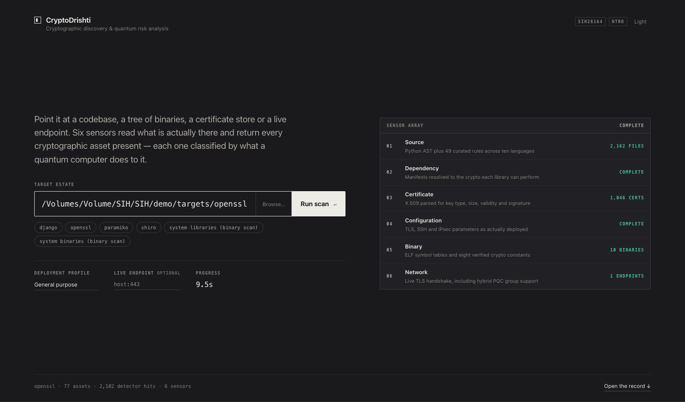
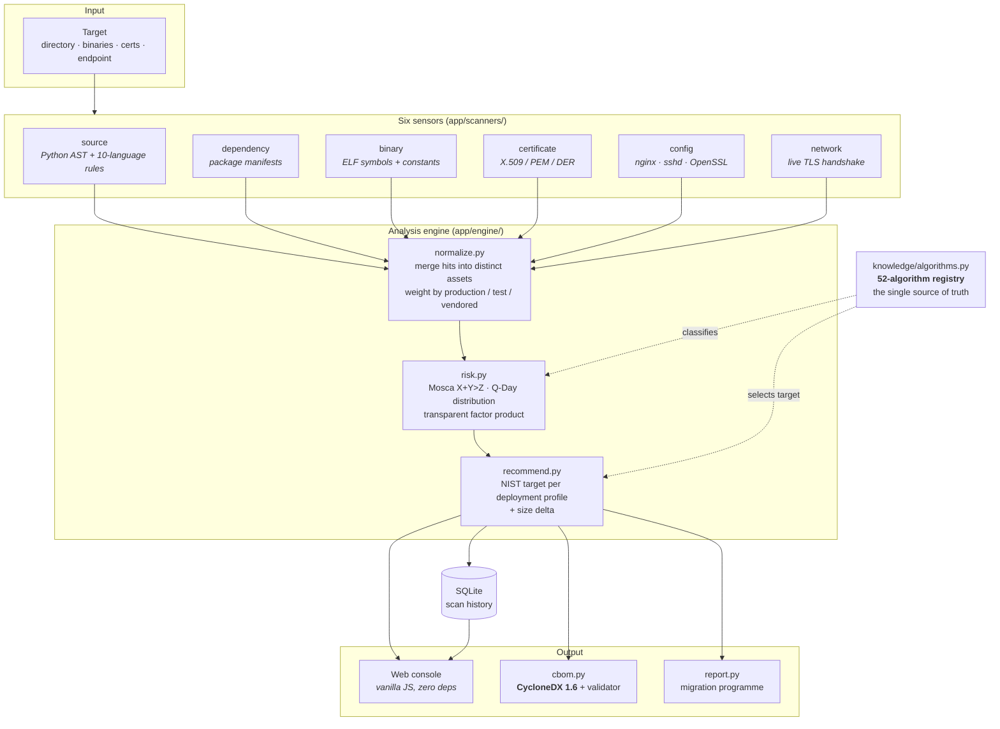
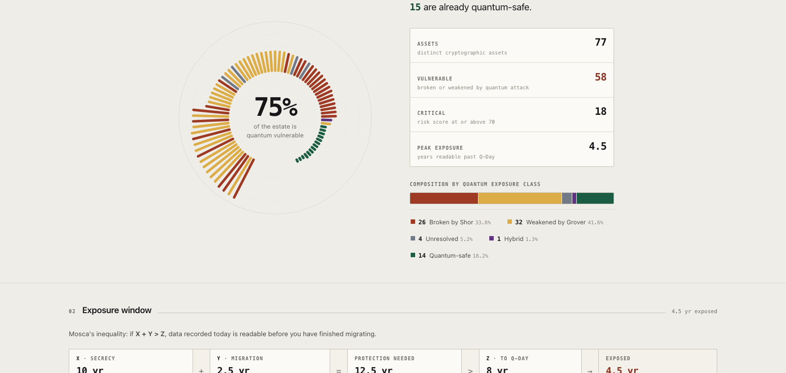
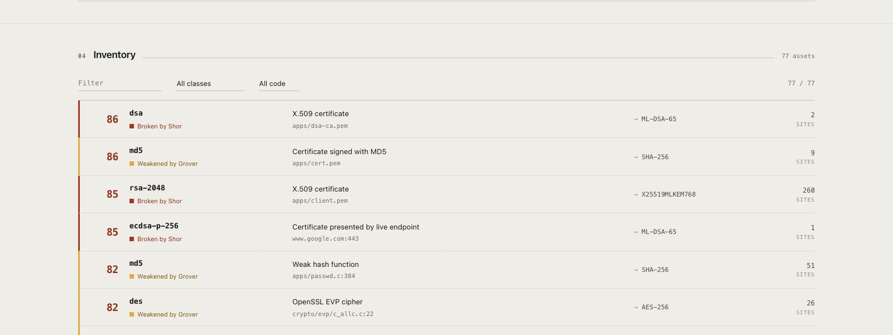
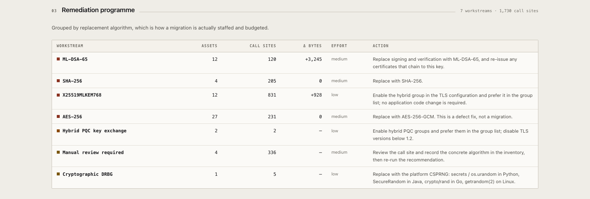
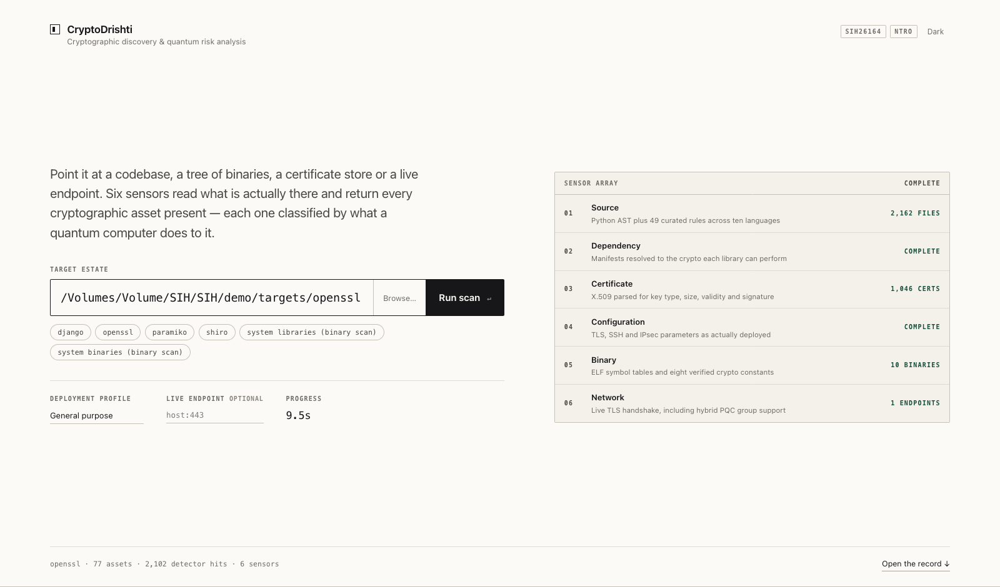
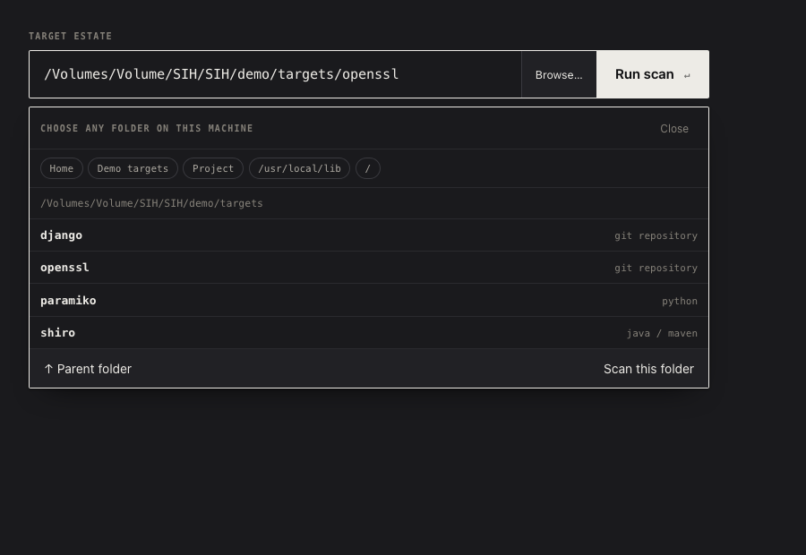
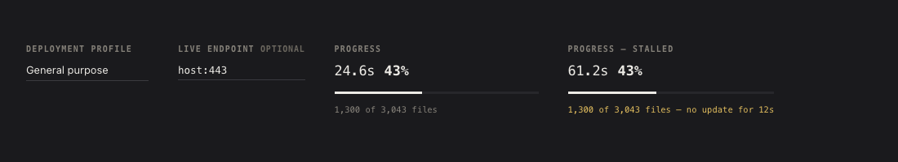
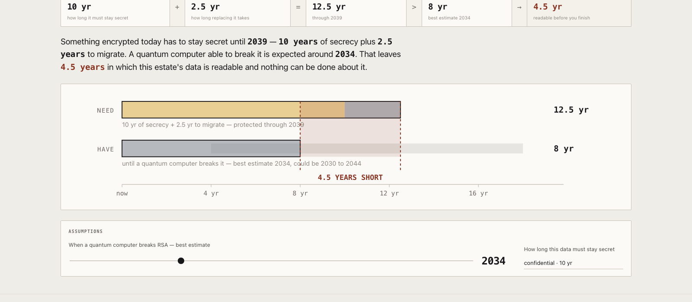
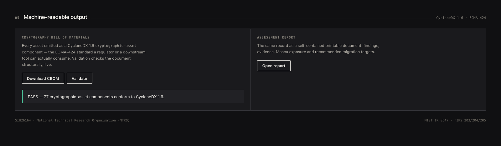

# CryptoDrishti

**Cryptographic discovery and quantum risk analysis.**

CryptoDrishti finds every cryptographic artefact in a codebase and its
infrastructure, scores each one for exposure to quantum attack, recommends a
post-quantum replacement, and emits a standards-conformant
[CycloneDX 1.6](https://cyclonedx.org/) CBOM.

Built for Smart India Hackathon 2026, problem statement **SIH26164**
(National Technical Research Organisation).

[](https://github.com/sgtsujith141-wq/cryptodrishti/actions/workflows/ci.yml)
[](https://www.python.org/)
[](https://cyclonedx.org/)
[](#testing)



---

## The problem

Post-quantum migration is mandated before anyone is ready for it. NIST has
published the replacement algorithms (ML-KEM, ML-DSA, SLH-DSA) and set
deprecation milestones in IR 8547, but an organisation cannot migrate what it
cannot enumerate. In practice nobody knows where their cryptography actually
is: it is scattered across application source, transitive dependencies,
compiled binaries with no source available, certificate stores, deployment
configuration and live TLS endpoints.

The pressure is not theoretical. Under **harvest-now-decrypt-later**, an
adversary records encrypted traffic today and decrypts it once a
cryptographically relevant quantum computer exists. Data with a long
confidentiality requirement is therefore already exposed — the clock started
when the traffic was recorded, not when the quantum computer arrives.

That reframes the question from *"is my crypto broken yet?"* to *"will the data
I am sealing today still be secret when it stops being secret?"* — which is a
question about **shelf life, migration time and an unknown arrival date**, not
about algorithms alone.

## What I built

A single-operator tool that answers that question end to end:

1. **Six independent sensors** read what is actually present, rather than
   trusting a manifest or a policy document.
2. Raw detector hits are **normalised into distinct cryptographic assets**, so
   one algorithm seen 800 times is one migration item with 800 call sites — not
   800 findings.
3. Each asset is **scored through Mosca's inequality**, with Q-Day modelled as
   a probability distribution rather than asserted as a date.
4. A **recommender** selects a concrete NIST replacement for the deployment
   profile, and quantifies the size penalty that will break fixed-width
   protocol fields.
5. Everything is exported as a **CycloneDX 1.6 CBOM** and rendered in an
   offline web console.

It runs **fully air-gapped**. There are no outbound network requests, no CDN
assets and no telemetry. The single exception is the network sensor, which
connects to exactly the endpoints you name.

## Architecture



**The registry is the load-bearing piece.** Every finding resolves to an entry
in `app/knowledge/algorithms.py`, and that entry decides how it is classified,
scored and remediated. Getting a classification wrong there is wrong
everywhere downstream, which is why it is the most heavily tested module in the
project.

## Verified features

Everything below is exercised by the test suite or reproducible with the
commands given in [Testing](#testing).

### Six sensors

| Sensor | Technique | Strength of evidence |
|---|---|---|
| `source` | Python AST analysis; curated rule packs for Java, C/C++, Go, JS/TS, C#, Ruby, PHP | AST resolves parameters (`key_size=1024`); regex packs do not |
| `dependency` | Package manifests mapped to library crypto capability and PQC support | Capability, not proof of use |
| `binary` | ELF symbol tables, cryptographic constant matching, version banners | Symbols are strong; raw strings are weak |
| `certificate` | X.509, PEM/DER, private key material, including PQC certificates | Parsed, not guessed |
| `config` | nginx, Apache, sshd, OpenSSL, Java security policy | As actually deployed |
| `network` | Live TLS probing, including hybrid PQC group negotiation | Ground truth for what is negotiated |

### Classification

52 algorithms, split the standard three ways — and the split is the point:

- **Shor-broken** (20) — RSA, DSA, DH, ECDH, ECDSA, Ed25519, X25519. A total
  break. **Increasing the key size does not help**, which is why RSA-4096 and
  RSA-1024 are both classified broken.
- **Grover-weakened** (12) — AES-128, 3DES, SHA-1, MD5, RC4. Effective security
  halves, so the fix is a **parameter change, not an algorithm change**.
- **Quantum-safe** (18) — ML-KEM, ML-DSA, SLH-DSA, FN-DSA, AES-256, SHA-384/512.
- **Hybrid** (1) — X25519 + ML-KEM-768, and **unresolved** (1).

The distinction that drives the whole recommender: `AES-128` is weakened but
`AES-256` is safe, so symmetric findings get a key-length fix; RSA at any size
is broken, so it gets a new algorithm.

### Risk scoring

Mosca's inequality — **X + Y > Z**, where X is data confidentiality lifetime, Y
is migration time, and Z is years to a CRQC. Exposure is `X + Y − Z`.

Z is genuinely unknown, so it is **not asserted**. It is modelled as a
triangular distribution over (earliest, likely, latest) and reported as a
probability alongside the exposure at the median. The console lets you drag
those three years and re-rank the entire estate live.

Every score is a transparent product of named factors — base class weight,
algorithm adjustment, business criticality, exposure multiplier, Mosca term,
blast radius, confidence — and **each factor is surfaced in the UI next to its
input value**. Nothing is fitted or learned; a reviewer can audit the
arithmetic.

Findings are weighted by where the evidence lives, so a private key in a test
fixture is inventoried but does not outrank one in production code.

### Standards output

CycloneDX 1.6 (ECMA-424) with `cryptoProperties`, detection evidence in
`evidence.occurrences` and per-finding confidence in `evidence.identity`.
`cbom.validate()` checks required fields, enum membership and `bom-ref`
uniqueness — and **says plainly that it is a structural check, not full
JSON-Schema validation**.

## Screenshots

All captured from the running application scanning real repositories.

**Assessment** — estate composition, and Mosca's inequality shown as arithmetic
rather than a verdict:



**Inventory** — every asset ranked, each with its class, evidence location,
recommended replacement and call-site count:



**Remediation programme** — grouped by replacement algorithm, because that is
how a migration is actually staffed and budgeted:



<details>
<summary>More views — light theme, folder picker, live progress, exposure model, CBOM output</summary>

| | |
|---|---|
|  |  |
|  |  |
|  | |

</details>

## Installation

Requires **Python 3.11+**. No other system dependencies.

```bash
git clone https://github.com/sgtsujith141-wq/cryptodrishti.git
cd cryptodrishti

python3 -m venv .venv
./.venv/bin/pip install -r requirements.txt
./.venv/bin/python run.py
```

Open <http://127.0.0.1:8000> and point the console at any directory.

To start with the console already populated:

```bash
./.venv/bin/python run.py --seed --seed-path /path/to/some/repo
```

### Command line

```bash
# Scan a tree, print the ranked inventory, write a CBOM
./.venv/bin/python -m app.cli scan /path/to/repo --cbom cbom.json
```

### Demonstration targets

`demo/targets/` held local clones of OpenSSL, Django, Paramiko and Shiro during
development. They are third-party repositories totalling several hundred
megabytes and are **not committed**. Clone whichever you want:

```bash
mkdir -p demo/targets
git clone --depth 1 https://github.com/paramiko/paramiko demo/targets/paramiko
git clone --depth 1 https://github.com/openssl/openssl   demo/targets/openssl
```

## Configuration

There are no secrets and no `.env` file. Behaviour is tuned with optional
environment variables, all of which have working defaults:

| Variable | Default | Purpose |
|---|---|---|
| `CD_DB` | `data/scans.sqlite3` | Scan-history database location |
| `CD_MAX_FILES` | `25000` | Upper bound on files per scan, so a large repository finishes inside a demo |
| `CD_WORKERS` | `8` | Scanner thread-pool size |

Risk-model defaults — Q-Day estimates and shelf life by data sensitivity — live
in `app/config.py` and are overridable per scan from the console.

## Testing

```bash
./.venv/bin/pip install -r requirements-dev.txt
./.venv/bin/pytest
```

**226 tests, all passing** in under a second locally, covering:

| Suite | Tests | What it pins |
|---|---|---|
| `test_knowledge.py` | 38 | Classification of all 52 algorithms; RSA key size is irrelevant; AES-128 vs AES-256; unresolved is never treated as safe |
| `test_risk.py` | 30 | Mosca arithmetic, exposure floors, monotonicity, determinism; Shor-broken outranks Grover-weakened; production outranks test fixtures |
| `test_recommend.py` | 77 | Every algorithm yields an actionable target; no vulnerable algorithm is ever recommended as a replacement; profile changes the answer |
| `test_normalize.py` | 28 | Hit merging, path classification, sensor corroboration is not collapsed |
| `test_cbom.py` | 17 | CycloneDX 1.6 conformance — **and that the validator rejects malformed documents** |
| `test_scan_end_to_end.py` | 21 | Real fixture files in, scored findings and a valid CBOM out; survives unparseable and binary files |
| `test_api.py` | 15 | Every HTTP route the console calls, against a temporary database |

The suite writes to a temporary database, never to `data/`.

### Reproducing a real scan

```bash
git clone --depth 1 https://github.com/paramiko/paramiko demo/targets/paramiko
./.venv/bin/python -m app.cli scan demo/targets/paramiko
```

At paramiko commit `142f593` this reports **12 distinct cryptographic assets
across 70 files in 1.3s — 8 of them quantum-vulnerable (66.7%)**, correctly
separating production findings (ECDSA P-256/384/521 as critical, RSA as high,
AES as medium) from test-only ones (a private key in `tests/test_pkey.py`, weak
RNG in `tests/test_sftp_big.py`). Your numbers will differ as paramiko changes.

### Continuous integration

[`.github/workflows/ci.yml`](.github/workflows/ci.yml) runs the suite on Python
3.11, 3.12 and 3.13, then runs a separate smoke job that scans this repository,
emits a CBOM and **fails the build if the document does not conform** to
CycloneDX 1.6. The CBOM is uploaded as a build artifact.

## Engineering decisions and trade-offs

**Q-Day is a distribution, not a date.** Every commercial tool in this space
picks a year and scores against it. That is the single easiest thing for a
cryptographer to dismiss, because the honest answer is that nobody knows. I
model Z as a triangular distribution and report `P(exposed)` alongside the
median. *Trade-off:* a probability is harder to put on a dashboard tile than
"2030", and it makes the tool look less certain than its competitors.

**The score is arithmetic, not a model.** A transparent product of named
factors instead of anything fitted. *Trade-off:* it will be less accurate than
a model trained on real migration outcomes — but no such labelled dataset
exists, and a reviewer who can audit the arithmetic will trust the output. An
unauditable number in a security tool is worse than a slightly worse auditable
one.

**Findings are weighted by where the evidence lives.** An algorithm in
`tests/` gets 0.40× and vendored code 0.75×. Without this, scanning any real
repository puts test fixtures at the top of the queue and the report reads as
naive. *Trade-off:* path heuristics misfire on unconventional layouts.

**Unresolved is a first-class class, ranked above quantum-safe.** When the
scanner cannot statically resolve an algorithm it says so rather than guessing,
and the recommender returns "manual review required" instead of a plausible
replacement. Filing "we could not identify this" as good news is how scanners
lose trust.

**Six independent sensors rather than one good one.** They deliberately
overlap, and `normalize.py` does not merge findings across sensors — source and
binary evidence for the same algorithm corroborate each other, and collapsing
them would destroy that signal. *Trade-off:* the inventory is larger than a
naive deduplication would produce.

**Zero front-end dependencies.** The console is vanilla JavaScript with no
build step, no framework and no CDN. The tool is aimed at an air-gapped
environment, where a tool that needs npm at install time is a tool that does not
get installed. *Trade-off:* `app/web/app.js` is 1,200 hand-written lines, and
some of it would be shorter in React.

**CycloneDX rather than a bespoke format.** There is exactly one standard for
cryptographic inventory, so the output is consumable by anything that reads
CycloneDX. *Trade-off:* the schema does not have a natural place for a
Mosca-style risk model, so those fields live in a vendor extension.

**Structural validation, honestly labelled.** Bundling the CycloneDX JSON
schema would mean a network fetch or a vendored schema file and a validation
dependency, both of which conflict with running air-gapped. So `validate()`
does a thorough structural check and its output states exactly what it did and
did not verify.

## Known limitations

Stated plainly, because a security tool that overstates its coverage is
actively harmful.

- **Language coverage is uneven.** Full AST analysis is Python only. The other
  nine languages use curated regex rule packs, so recall is lower and
  parameters (key sizes, modes) often go unresolved. A Java finding is weaker
  evidence than a Python one.
- **Binary analysis is ELF-only.** Mach-O and PE binaries fall back to raw
  string scanning. A string match is not proof of linkage and is reported with
  lower confidence, but it is still weaker evidence than a symbol table.
- **RSA is modelled as key transport, not signing.** The registry assigns RSA
  the `pke` primitive, so an RSA *signature* call site is recommended a KEM
  (hybrid X25519+ML-KEM) rather than ML-DSA. Correct for key transport, wrong
  for signing. This is pinned by a test so it cannot change silently.
- **Dependency findings prove capability, not use.** Depending on a library
  that can do RSA is not evidence that RSA is used.
- **The network sensor reports what was negotiated with it**, which is not
  necessarily what the server supports or prefers for other clients.
- **No authentication, no multi-user support, no migrations.** Scan history is
  a local SQLite file. This is a single-operator tool.
- **Not packaged for distribution.** Run it from the source tree.
- **`app/api.py` uses the deprecated FastAPI `on_event` startup hook**, which
  emits two warnings. Harmless today; needs migrating to lifespan handlers.
- **Not independently audited.** The classifications follow NIST IR 8547 and
  the CycloneDX 1.6 specification as I read them; they have not been reviewed
  by a cryptographer.

## Future development

- Migrate the remaining nine languages from regex rule packs to real parsers
  (tree-sitter would cover all of them with one dependency).
- Mach-O and PE symbol-table parsing, to bring non-Linux binaries up to the
  evidence quality of ELF.
- Split RSA into distinct signing and key-transport entries so signature call
  sites are recommended ML-DSA.
- Container image layer scanning — the sensor interface exists
  (`TECH_CONTAINER`) but is not implemented.
- Differential scans: track an estate's PQC readiness over time rather than
  reporting a single snapshot.
- Package for `pipx` install, and migrate `on_event` to lifespan handlers.

## Repository layout

```
run.py                      entry point
app/
  knowledge/algorithms.py   52-algorithm registry — the source of truth
  knowledge/rules_*.py      detection rule packs (source, binary)
  scanners/                 the six sensors
  engine/normalize.py       hit merging and path weighting
  engine/risk.py            Mosca model and scoring
  engine/recommend.py       migration target selection
  cbom.py                   CycloneDX 1.6 emitter and validator
  api.py                    FastAPI routes
  web/                      console (vanilla JS, zero dependencies)
tests/                      226 tests
deck/index.html             offline presentation deck (arrow keys, P for notes)
presenter/                  timed script and Q&A sheet
Report/                     project report, design history and screenshots
docs/                       industry brief and build kit
```

## Tech stack

Python 3.11+ · FastAPI · Uvicorn · Pydantic · `cryptography` · SQLite ·
vanilla JavaScript (no build step, no framework, no CDN) · pytest · GitHub
Actions.

---

**Author:** Sujith C · Computer Science & Engineering
**Context:** Smart India Hackathon 2026 — SIH26164, National Technical Research
Organisation.
